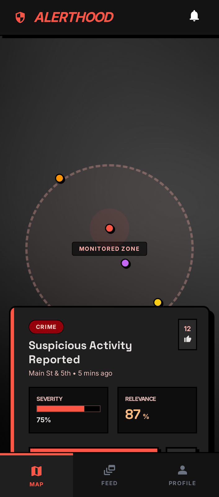
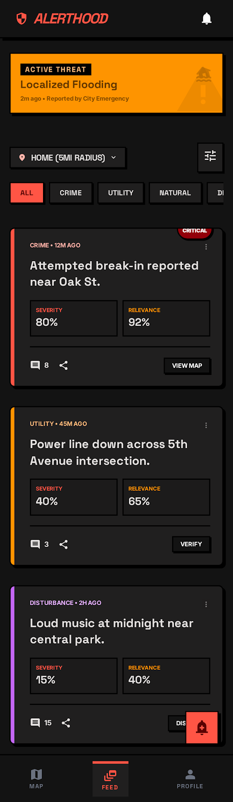
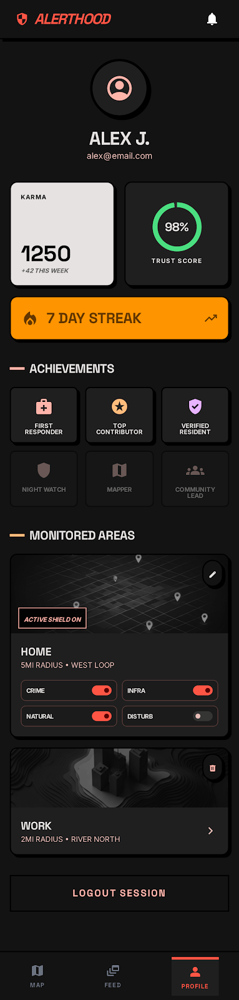

# AlertHood

**Know before you go.** AlertHood is a safety-awareness mobile web app that shows real-time and historical threat heatmaps for any area — so you can navigate your city with confidence.

---

## Screenshots

<table>
  <tr>
    <td align="center"><b>Map</b></td>
    <td align="center"><b>Threat Feed</b></td>
  </tr>
  <tr>
    <td></td>
    <td></td>
  </tr>
  <tr>
    <td align="center"><b>Area Dashboard</b></td>
    <td align="center"><b>Profile</b></td>
  </tr>
  <tr>
    <td></td>
    <td></td>
  </tr>
</table>

---

## Features

- **Safety Heatmap** — interactive dark map with green-to-red overlay based on incident density and severity, updated every 15 minutes
- **Neighborhood Boundaries** — color-coded GeoJSON polygons showing safety scores for each district, sourced from OpenStreetMap
- **Live Threat Feed** — real-time incident cards from 7 automated scrapers; filterable by category, severity, and monitored area
- **Voting System** — upvote/downvote events; event authors earn karma for accurate reports
- **Area Monitoring** — subscribe to up to 2 areas (free tier); configure per-category notification preferences and minimum severity
- **AI Safety Briefs** — LLM-generated (DeepSeek) 2–3 sentence safety summaries for any area, using live incident data
- **Real-time Notifications** — critical events in monitored areas pushed via Supabase Realtime
- **User Event Reporting** — report incidents at your GPS location with type, severity, title, and description
- **Safe Route Calculation** *(stretch)* — backend generates waypoints that avoid dangerous areas, with a Google Maps link
- **7 Data Sources** — GDELT, UK Police API, Bulgarian News (AI-extracted), GNews, EMSC (seismic), GDACS (disasters), MeteoAlarm (weather)

---

## Tech Stack

| Layer | Technology |
|-------|-----------|
| **Frontend** | React 18, TypeScript 5.5, Vite 5, Tailwind CSS 3 |
| **Maps** | Leaflet 1.9 + react-leaflet 4.2 (CartoDB Dark Matter tiles) |
| **Backend** | FastAPI 0.115 (Python 3.11), Pydantic Settings |
| **Database** | Supabase (PostgreSQL + PostGIS + Auth + Realtime) |
| **AI / LLM** | DeepSeek via OpenRouter (news extraction + area safety briefs) |
| **Geo** | PostGIS, OpenStreetMap Overpass API, geopy |
| **Article Parsing** | trafilatura |
| **Auth** | Supabase Auth (email/password + Google OAuth), JWT via JWKS (ES256) |
| **Frontend Deploy** | Cloudflare Pages (GitHub Actions) |
| **Backend Deploy** | FastAPI Cloud |
| **Package Management** | uv (Python), npm (Node.js) |
| **Linting / CI** | ruff (Python), TypeScript compiler, GitHub Actions |

---

## Architecture

```
┌─────────────────────────────┐
│        React SPA             │  ← Cloudflare Pages
│  (Vite + Tailwind + Leaflet) │
└────────────┬────────────────┘
             │ REST API (authenticated)
             ▼
┌─────────────────────────────┐
│        FastAPI Backend       │  ← FastAPI Cloud
│  ┌──────────────────────┐   │
│  │  Scraper Loop (15min)│   │
│  │  GDELT · UK Police   │   │
│  │  EMSC · GDACS        │   │
│  │  MeteoAlarm · GNews  │   │
│  │  BG News + AI        │   │
│  └──────────────────────┘   │
│  ┌──────────────────────┐   │
│  │  Services            │   │
│  │  Safety Scoring      │   │
│  │  AI Extraction       │   │
│  │  Route Engine        │   │
│  │  Notifications       │   │
│  └──────────────────────┘   │
└────────────┬────────────────┘
             │ Supabase SDK (service role)
             ▼
┌─────────────────────────────┐
│          Supabase            │  ← Supabase Cloud
│  PostgreSQL + PostGIS        │
│  Auth · Realtime             │
│  Row Level Security          │
└─────────────────────────────┘
             ▲
             │ Supabase JS client (anon key, direct reads)
             │
      React Frontend
```

> The frontend reads data (events, profiles, subscriptions, notifications) directly from Supabase using the JS client. The FastAPI backend handles writes, business logic, scraping, and scoring.

---

## Project Structure

```
alerthood/
├── frontend/                        # React SPA (Vite + TypeScript)
│   └── src/
│       ├── pages/
│       │   ├── MapPage.tsx          # Full-screen heatmap
│       │   ├── FeedPage.tsx         # Live threat feed
│       │   ├── AreaPage.tsx         # Area safety dashboard
│       │   ├── ProfilePage.tsx      # User profile & monitored areas
│       │   └── AuthPage.tsx         # Login / sign-up
│       ├── components/
│       │   ├── map/                 # MapView, ThreatMarker, DistrictBottomSheet, AddEventModal
│       │   ├── feed/                # FeedView, ThreatCard, FilterBar, ActiveThreatBanner
│       │   ├── area/                # AreaSummaryView, SafetyScoreGauge, AIAreaBrief, MiniHeatmap
│       │   ├── profile/             # ProfileView, AreaPickerMap, BadgeGrid, MetricsBento
│       │   ├── layout/              # TopBar, BottomNav, NotificationPanel
│       │   └── auth/                # ProtectedRoute
│       ├── hooks/
│       │   ├── useAuth.ts
│       │   ├── useHeatmap.ts
│       │   ├── useAreas.ts
│       │   ├── useNeighborhoods.ts
│       │   ├── useNotifications.ts
│       │   ├── useScores.ts
│       │   ├── useSafeRoute.ts
│       │   └── useAlertPrefs.ts
│       ├── context/                 # AuthContext (React Context + Supabase listener)
│       ├── lib/                     # api.ts, supabase.ts, userLocation.ts
│       └── types/                   # TypeScript interfaces
│
├── backend/                         # FastAPI (Python 3.11)
│   ├── main.py                      # App entry, CORS, scraper loop
│   ├── auth.py                      # JWT verification via Supabase JWKS
│   ├── config.py                    # Pydantic Settings from .env
│   ├── db.py                        # Supabase client singleton
│   ├── models/schemas.py            # Pydantic models
│   ├── routers/
│   │   ├── events.py                # POST /api/events, GET /api/events/heatmap
│   │   ├── areas.py                 # Area detection, subscriptions, AI summary
│   │   ├── neighborhoods.py         # GeoJSON boundaries for map
│   │   ├── routes.py                # POST /api/routes/safe
│   │   └── scores.py                # Neighborhood safety scores
│   ├── services/
│   │   ├── scraper.py               # GDELT scraper (global, every 15 min)
│   │   ├── bg_news_scraper.py       # Bulgarian news + AI extraction
│   │   ├── uk_police_scraper.py     # UK Police API
│   │   ├── gnews_scraper.py         # GNews API
│   │   ├── emsc_scraper.py          # European seismic events
│   │   ├── gdacs_scraper.py         # Global disaster alerts
│   │   ├── meteoalarm_scraper.py    # European weather alerts
│   │   ├── ai_extractor.py          # DeepSeek: filter + extract news articles
│   │   ├── ai_summary.py            # DeepSeek: area safety brief generator
│   │   ├── safety_score.py          # Heatmap weight computation
│   │   ├── neighborhood_scores.py   # Composite safety score calculator
│   │   ├── route_engine.py          # Safe route waypoint generator
│   │   ├── geocoding.py             # Location resolution
│   │   ├── boundary_ingestion.py    # OSM neighborhood boundary import
│   │   ├── overpass.py              # OpenStreetMap Overpass API client
│   │   ├── notify.py                # Post-scrape notification dispatch
│   │   ├── insert_events.py         # Batch event insertion
│   │   └── article_fetcher.py       # Article text extraction (trafilatura)
│   └── tests/                       # Unit tests
│
├── supabase/
│   ├── migrations/                  # ~30 SQL migration files
│   └── seed.sql
│
├── design/                          # Design mockups + DESIGN.md spec
├── tasks/                           # todo.md task tracker
├── .github/workflows/               # CI (lint + build) + deploy-frontend
├── wrangler.toml                    # Cloudflare Pages config
├── DEPLOY.md                        # Deployment runbook
└── AGENTS.md                        # AI agent workflow instructions
```

---

## Frontend Architecture

### Routing

```
/           → redirect to /map
/map        → MapPage        (protected)
/feed       → FeedPage       (protected)
/area       → AreaPage       (protected)
/profile    → ProfilePage    (protected)
/auth       → AuthPage       (public)
```

All protected routes use `ProtectedRoute`, which redirects unauthenticated users to `/auth`. The root `App.tsx` wraps everything in `AuthProvider` and renders `TopBar` + `BottomNav` around the page outlet.

### Hooks

Each hook is responsible for one slice of data. They talk to either the FastAPI backend (via `lib/api.ts`) or directly to Supabase (via `lib/supabase.ts`).

| Hook | Source | Responsibility |
|------|--------|----------------|
| `useAuth` | AuthContext | Exposes auth state, signIn/signUp/signOut/OAuth methods |
| `useHeatmap` | Backend `GET /api/events/heatmap` | Heatmap cells for an area + time bucket |
| `useAreas` | Backend `/api/areas/*` | Area detection from GPS, subscribe/unsubscribe, notification prefs |
| `useNeighborhoods` | Backend `GET /api/neighborhoods` | GeoJSON boundaries for the current map viewport (debounced 300ms) |
| `useNotifications` | Supabase direct + Realtime | Unread notification list, marks as read, live INSERT/UPDATE listener |
| `useScores` | Backend `GET /api/scores` | Neighborhood safety scores for all active areas |
| `useSafeRoute` | Backend `POST /api/routes/safe` | Safe route waypoints + Google Maps URL |
| `useAlertPrefs` | `localStorage` | "Show nearest alerts" preference, persisted across sessions |

### Context

**`AuthContext`** manages the full auth lifecycle:

1. On mount, gets the current Supabase session and fetches the user's `profiles` row
2. Subscribes to `onAuthStateChange` for live session updates
3. On sign-up, waits 500ms for the `handle_new_user` DB trigger to fire, then upserts the profile as fallback (covers OAuth users whose trigger may not have run)
4. Exposes `{ user, session, profile, loading, signUp, signIn, signInWithGoogle, signOut }`

### `lib/api.ts` — HTTP wrapper

All authenticated requests go through this module. It auto-attaches the current Supabase JWT as `Authorization: Bearer {token}`. Public requests use `apiGetPublic`. Error responses extract the `detail` field from FastAPI JSON errors.

```
apiGetPublic(path, params?)   → no auth
apiGet(path, params?)         → JWT
apiPost(path, body)           → JWT
apiPatch(path, body)          → JWT
apiDelete(path)               → JWT
```

### Component Map

```
components/
├── map/
│   ├── MapView              Full-screen Leaflet map, heatmap overlay, neighborhood layer
│   ├── ThreatMarker         Colored marker per event (severity-coded)
│   ├── AlertBottomSheet     Slide-up panel: event detail, severity bar, voting, source link
│   ├── DistrictBottomSheet  Slide-up panel: neighborhood safety stats, subscribe button
│   ├── AddEventModal        Full modal to report a user event at current GPS position
│   └── MonitoredZone        Dashed circle overlay for subscribed areas
├── feed/
│   ├── FeedView             Scrollable event list with area + category + severity filters
│   ├── ThreatCard           Event card with upvote/downvote and "VIEW MAP" navigation
│   ├── FilterBar            Category pill filter (ALL / CRIME / UTILITY / NATURAL / DISTURBANCE)
│   ├── SeverityBar          Severity pill filter (ALL / LOW / MEDIUM / HIGH / CRITICAL)
│   └── ActiveThreatBanner   Sticky top banner for the top-voted active threat
├── area/
│   ├── AreaSummaryView      Area dashboard shell, auto-detects user's area from GPS
│   ├── SafetyScoreGauge     Circular 0-100 score with LOW / MEDIUM / HIGH RISK badge
│   ├── AIAreaBrief          DeepSeek-generated 2-3 sentence safety summary
│   ├── MiniHeatmap          Small embedded Leaflet map of recent incidents
│   ├── ActiveAlertCard      Highlighted high/critical events from the last 24h
│   └── RecentIncidentsList  Last 48h events, up to 5 items
├── profile/
│   ├── ProfileView          Avatar, karma, badges, monitored areas, logout
│   ├── AreaPickerMap        Map picker for selecting a new monitored area
│   ├── MonitoredAreaCard    Per-subscription card with notification toggles and delete
│   ├── BadgeGrid            6 achievement badges (First Responder, Top Contributor, etc.)
│   └── MetricsBento         Karma + streak metrics grid
└── layout/
    ├── TopBar               Branding, notification bell (unread count badge), avatar
    ├── BottomNav            4-tab mobile nav: MAP / FEED / AREA / PROFILE
    └── NotificationPanel    Dropdown list of unread notifications with mark-as-read
```

---

## Backend Architecture

### Startup & Scraper Loop

`main.py` uses FastAPI's `@asynccontextmanager` lifespan to run setup on startup:

1. **Boundary ingestion** — checks if neighborhood boundaries exist in the DB; if not, runs `ingest_all_cities()` to pull GeoJSON from the OpenStreetMap Overpass API (5-second rate-limit between requests)
2. **Scraper loop** — spawns a background `asyncio` task that runs every `SCRAPER_INTERVAL_MINUTES` (default 15):
   - Runs all 7 scrapers concurrently via `asyncio.gather()`
   - Calls `dispatch_recent_notifications()` after each cycle
   - Calls `refresh_all_scores()` to recompute neighborhood safety metrics
   - Catches and logs all exceptions without stopping the loop

### Auth (`auth.py`)

JWT verification via Supabase JWKS — no static secret required:

1. Extracts `kid` from the unverified token header
2. Fetches `{supabase_url}/auth/v1/.well-known/jwks.json` (cached 1 hour)
3. Decodes with ES256 + matching public key
4. Verifies `aud == "authenticated"`, extracts `sub` as `user_id`
5. Raises HTTP 401 on any failure

Used as a FastAPI `Depends()` on all protected endpoints.

### Router Summary

| Router | Prefix | Endpoints |
|--------|--------|-----------|
| `events.py` | `/api/events` | `POST /` create event · `GET /heatmap` weighted heatmap cells |
| `areas.py` | `/api/areas` | `GET /detect` GPS→area · `POST /summary` AI brief · `POST /subscribe` · `DELETE /{id}/subscribe` · `PATCH /subscriptions/{id}/notifications` |
| `neighborhoods.py` | `/api/neighborhoods` | `GET /` GeoJSON boundaries for map viewport |
| `scores.py` | `/api/scores` | `GET /` all safety scores · `POST /refresh` force recompute |
| `routes.py` | `/api/routes` | `POST /safe` safe route with waypoints |

### Dependency Injection

| Dependency | Source | Used for |
|-----------|--------|---------|
| `get_current_user` | `auth.py` | Extracts `user_id` from JWT |
| `get_supabase` | `db.py` | Singleton Supabase client (service role) |
| `get_settings` | `config.py` | `lru_cache`-backed Pydantic settings |

---

## Backend Service Overview

### `safety_score.py` — Heatmap Generation

Computes weighted heatmap cells for a given area and time bucket.

**Algorithm:**
1. Fetches events in area via `events_in_area` RPC
2. Filters by time bucket (morning 6–12, afternoon 12–18, evening 18–24, night 0–6)
3. Overlays a 30×30 grid on the area's bounding box (+10% padding)
4. For each event: `weight = severity_weight × recency_weight`
   - Severity weights: low=0.25 · medium=0.5 · high=0.75 · critical=1.0
   - Recency: exponential decay with **7-day half-life**
5. Normalises all weights to 0–1 and returns non-zero cells

---

### `neighborhood_scores.py` — Safety Score Computation

Computes and persists composite safety scores for all active areas.

**Formula:** `score = 100 − (crime_rate_pct × 0.7 + poverty_pct × 0.3)` · clamped 0–100

**Color mapping** (stored as `safety_color` on the `areas` row):

| Score | Color | Hex |
|-------|-------|-----|
| 81–100 | Dark Red | `#7f1d1d` |
| 61–80 | Red | `#ef4444` |
| 41–60 | Orange | `#f97316` |
| 21–40 | Yellow | `#eab308` |
| 0–20 | Green | `#22c55e` |

`refresh_all_scores()` attempts the `area_crime_stats_batch` RPC for a single-query bulk refresh; falls back to per-area queries if the migration hasn't been applied.

---

### `route_engine.py` — Safe Route Calculation

Generates a waypoint path from origin to destination that avoids dangerous events.

**Algorithm:**
1. Builds a bounding box (origin ↔ destination + 0.02° padding)
2. Fetches all active events in the box via `events_in_bbox` RPC
3. Divides the direct path into 11 evenly spaced waypoints
4. For each waypoint, checks distance to every nearby event (Haversine)
5. If within the danger radius, shifts the waypoint **perpendicular to the route** by 0.005° (~500m)
   - Danger radii: low=100m · medium=300m · high=500m · critical=800m
6. Returns waypoints, a Google Maps directions URL, avoided event count, and total distance in km

---

### `notify.py` — Notification Dispatch

Runs after every scraper cycle to alert subscribed users of nearby critical events.

**Flow:**
1. Queries `events` for **critical** severity events created in the last `interval + 5` minutes
2. Groups by `area_id`, queries `user_area_subscriptions` for matching subscribers
3. Inserts `notifications` rows in batches of 50
4. Uses `ON CONFLICT DO NOTHING` on `(user_id, event_id)` to prevent duplicates

> Only **critical** severity events trigger notifications (not high/medium/low).

---

### `ai_extractor.py` — DeepSeek News Extraction

Two-stage LLM pipeline for extracting structured events from Bulgarian crime news.

**Stage 1 — Relevance filter:**
- Input: list of article titles
- Prompt: classify which titles describe crime/safety/violence in Bulgaria
- Output: `{ "relevant": [0, 2, 5] }` — list of relevant indices

**Stage 2 — Structured extraction:**
- Input: title + article body (truncated to 4000 chars)
- Output:
  ```json
  {
    "city": "Sofia",
    "location_text": "bul. Vitosha 1",
    "threat_type": "crime|disturbance|infrastructure",
    "severity": "low|medium|high|critical",
    "title_en": "English title",
    "summary_en": "2-3 sentence English summary"
  }
  ```
- Returns `null` if `location_text` is empty (un-geocodable events are discarded)

Both stages use temperature=0 with JSON response mode.

---

### `ai_summary.py` — Area Safety Brief Generator

Generates a concise 2–3 sentence safety brief for the Area tab, addressed directly to the user.

**Input:** area name, safety score (0–100), risk level, crime stats, 7d/30d/90d incident trends, active alerts, recent incidents (48h)

**Prompt rules:** address user as "you", reference only provided data, mention trends if rising/falling, no bullet points or generic tips, 2–3 sentences only.

**Output:** `{ "brief": "..." }` — plain prose safety summary

Temperature=0.3 · max_tokens=200 · JSON mode.

---

## Getting Started

### Prerequisites

- Node.js 20+
- Python 3.11+
- [uv](https://docs.astral.sh/uv/) (`pip install uv`)
- A [Supabase](https://supabase.com) project with PostGIS enabled
- A [DeepSeek](https://openrouter.ai) API key (via OpenRouter)

### Backend

```bash
cd backend
cp .env.example .env   # fill in values (see table below)
uv sync
uv run fastapi dev     # http://localhost:8000
```

### Frontend

```bash
cd frontend
cp .env.example .env   # fill in values (see table below)
npm install
npm run dev            # http://localhost:5173
```

### Environment Variables

**Backend (`.env`)**

| Variable | Description | Default |
|----------|-------------|---------|
| `SUPABASE_URL` | Supabase project URL | required |
| `SUPABASE_SERVICE_KEY` | Service role key — **never expose to frontend** | required |
| `SUPABASE_JWT_SECRET` | JWT secret from Supabase (legacy, unused with JWKS) | required |
| `CORS_ORIGINS` | JSON array of allowed frontend origins | `["http://localhost:5173"]` |
| `SCRAPER_INTERVAL_MINUTES` | Scrape cycle frequency | `15` |
| `DEMO_CITY` | Default city for scrapers | `Chicago` |
| `OPENWEATHER_API_KEY` | OpenWeatherMap API key | optional |
| `DEEPSEEK_API_KEY` | DeepSeek API key via OpenRouter | required for AI features |
| `DEEPSEEK_BASE_URL` | OpenRouter base URL | `https://openrouter.ai/api/v1` |
| `DEEPSEEK_MODEL` | Model identifier | `deepseek/deepseek-chat` |

**Frontend (`.env`)**

| Variable | Description |
|----------|-------------|
| `VITE_API_URL` | Backend URL (e.g. `http://localhost:8000`) |
| `VITE_SUPABASE_URL` | Supabase project URL |
| `VITE_SUPABASE_ANON_KEY` | Supabase anon/public key |

---

## API Endpoints

| Method | Path | Auth | Description |
|--------|------|------|-------------|
| `GET` | `/health` | — | Health check |
| `GET` | `/api/events/heatmap` | — | Heatmap cells with severity-weighted scores |
| `POST` | `/api/events` | JWT | Create a user-reported event |
| `GET` | `/api/areas/detect` | JWT | Detect area from coordinates |
| `POST` | `/api/areas/subscribe` | JWT | Subscribe to an area (max 2 on free tier) |
| `DELETE` | `/api/areas/subscriptions/{id}` | JWT | Unsubscribe from an area |
| `PATCH` | `/api/subscriptions/{id}/notifications` | JWT | Update notification preferences |
| `POST` | `/api/areas/summary` | JWT | Generate AI safety brief for an area |
| `GET` | `/api/neighborhoods` | — | GeoJSON neighborhood boundaries for map viewport |
| `GET` | `/api/scores` | — | Neighborhood safety scores |
| `POST` | `/api/routes/safe` | JWT | Calculate safe route between two coordinates |

> Direct reads (events feed, profile, subscriptions, notifications) go from the frontend directly to Supabase using the anon key — FastAPI only handles writes and business logic.

---

## Database Schema

### Core Tables

| Table | Purpose |
|-------|---------|
| `profiles` | Extends `auth.users` — username, display_name, avatar_url, karma |
| `areas` | Cities and neighborhoods with PostGIS boundaries, safety scores, OSM metadata |
| `events` | Threat events — location (PostGIS Point), severity, threat_type, status, source |
| `user_area_subscriptions` | User-to-area monitoring links with per-category notification preferences |
| `notifications` | Per-user notifications created after each scraper cycle |
| `event_votes` | Upvote/downvote tracking; trigger updates author karma automatically |
| `neighborhood_scores` | Computed composite safety scores per area |

### Key RPC Functions

| Function | Description |
|----------|-------------|
| `events_with_coords(max_rows)` | Events with lat/lng extracted from PostGIS geometry |
| `events_in_area(area_id, max_rows)` | Events within an area's boundary using `ST_DWithin` |
| `find_nearest_area(point)` | Closest area to a GPS coordinate |
| `neighborhoods_in_bbox(...)` | GeoJSON boundaries for a map viewport at a given zoom level |
| `area_bbox(area_id)` | Bounding box of an area |
| `area_crime_stats_batch(since_days)` | Batch crime count and area size for all active areas |

### Row-Level Security

All tables have RLS enabled. `profiles`, `areas`, and `events` are publicly readable. `user_area_subscriptions` and `notifications` are scoped to the authenticated owner. Scrapers use the service role key to bypass RLS.

---

## Data Sources

| Scraper | Source | Data Type |
|---------|--------|-----------|
| GDELT | [GDELT Project](https://www.gdeltproject.org) | Global crime, protests, conflicts from news (CAMEO codes) |
| UK Police | [data.police.uk](https://data.police.uk) | UK street-level crime records |
| Bulgarian News | Bulgarian news sites + DeepSeek AI | Local crime news (extracted + translated to English) |
| GNews | [GNews API](https://gnews.io) | English-language crime and safety news |
| EMSC | [EMSC](https://www.emsc-csem.org) | European seismic events |
| GDACS | [GDACS](https://www.gdacs.org) | Global disaster alerts (floods, cyclones, volcanoes) |
| MeteoAlarm | [MeteoAlarm](https://www.meteoalarm.org) | European severe weather warnings |

The scraper loop runs all 7 sources in parallel every 15 minutes. After each cycle, critical events in monitored areas trigger notifications for subscribed users.

---

## Deployment

See [DEPLOY.md](./DEPLOY.md) for the full runbook. Quick summary:

```bash
# Backend → FastAPI Cloud
cd backend && uv run fastapi deploy

# Frontend → Cloudflare Pages (auto-deploys via GitHub Actions on push to main)
# Manual:
cd frontend && npm run build
```

### CI/CD

| Workflow | Trigger | Steps |
|----------|---------|-------|
| `ci.yml` | Every PR and push to `main` | `ruff check` (backend) + `npm run build` (frontend) |
| `deploy-frontend.yml` | Push to `main` (frontend changes only) | Build + deploy to Cloudflare Pages |

---

## Design System

Neo-brutalist aesthetic — hard shadows, thick borders, no smooth animations.

- **Fonts:** Space Grotesk (headlines) / Inter (body)
- **Shadows:** `4px 4px 0px #000000` — hard only, never blurred
- **Borders:** 2–3px solid black
- **Transitions:** 0.1s or none
- **Map tiles:** CartoDB Dark Matter (dark theme throughout)

See [`design/alerthood_neo_noir/DESIGN.md`](./design/alerthood_neo_noir/DESIGN.md) for the full spec.

---

## Contributing

1. Fork the repo and create a branch from `main`
2. Make your changes — keep them focused and minimal
3. Ensure CI passes: `ruff check` in `backend/`, `npm run build` in `frontend/`
4. Open a pull request with a clear description of what changed and why

---

## License

MIT
